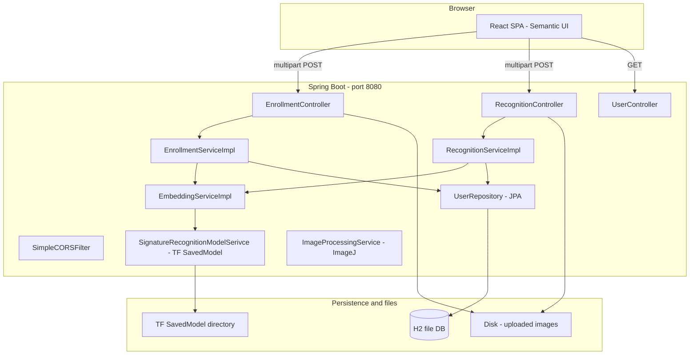

# Signature Verification System (Siamese Spring Boot + TensorFlow)

This repository implements a **signature verification / identification** system: enroll users with signature images, store a learned **embedding template** per user, and **recognize** new signatures by comparing embeddings in vector space.

The Maven artifact is `siamese` (display name **SiameseSpringBootTF**).

---

## What This Project Does

### Enrollment

You register a person under a **name** and upload **one or more signature images**. The backend runs each image through a **TensorFlow SavedModel** and produces a numeric **embedding** (a fixed-length vector). Those vectors are **averaged** into one template embedding per user, which is stored in the database together with metadata (`numImages`, timestamps).

### Recognition

You upload a **query signature image**. The same model produces an embedding. The backend compares it to **every enrolled user** using **Euclidean distance** in embedding space. It returns **all users sorted by distance** plus an optional **`bestMatch`** if the distances satisfy configurable **thresholds** (maximum allowed distance for a match, and a minimum gap between the best and second-best match to reduce ambiguous accepts).

Conceptually this is a **Siamese-style** pipeline: one shared encoder for enroll and verify; similarity is geometric distance between embeddings, not a separate classifier per user.

---

## High-Level Architecture



### Layers

| Layer | Role |
|--------|------|
| **React (`src/main/webapp`)** | Tabs for enroll, recognize, and user list; uses `axios` to call `http://localhost:8080/...` during local dev. |
| **REST controllers** | Map HTTP to services; persist uploads under `images.save.path`. |
| **Services** | Enrollment (mean embedding, persist user), recognition (embed query, distance to all users, thresholds). |
| **TensorFlow** | `SavedModelBundle.load(path, "serve")`; session run with **file path strings** as input; reads the **`embeddings`** output. |
| **JPA / H2** | `User` entity: name, `numImages`, `embedding` (JSON string), UUID id. |
| **CORS** | `SimpleCORSFilter` allows browser calls from another origin (e.g. React dev server on port 3000). |

---

## Technology Stack

### Backend

- **Java 8** — Set in `pom.xml`.
- **Spring Boot 2.1.5** — Web API, dependency injection, auto-configuration.
- **spring-boot-starter-web** — REST controllers, multipart uploads.
- **spring-boot-starter-data-jpa** + **H2** — Persistence; file-backed H2 database.
- **spring-boot-starter-data-rest** — Included in dependencies (repository REST exposure may apply depending on configuration).
- **Lombok** — Less boilerplate on entities and services.
- **Jackson** — Serialize/deserialize embedding vectors to/from the `TEXT` column in the database.
- **TensorFlow Java 1.12.0** — Loads a **SavedModel** and runs inference (`SignatureRecognitionModelSerivce`).
- **ImageJ (`net.imagej:ij`)** — Image utilities in `ImageProcessingServiceImpl` (resize / tensor helpers); the active embedding path feeds **image file paths** into TensorFlow as defined by the SavedModel.

### Frontend

- **Create React App** — App under `src/main/webapp` (see `src/main/webapp/README.md` for CRA scripts).
- **Semantic UI React** — Layout, forms, tables.
- **axios** — Multipart POSTs to the backend.
- **toastr** — Success/error notifications.

### Build

- **frontend-maven-plugin** — Installs Node/Yarn, runs `yarn install` and `yarn build`, then copies `webapp/build` into `target/classes/static` so a single Spring Boot artifact can serve the SPA.

---

## Configuration

`src/main/resources/application.properties`:

```properties
spring.h2.console.enabled=true
spring.datasource.url=jdbc:h2:file:~/h2/persist

spring.servlet.multipart.max-file-size=100MB
spring.servlet.multipart.max-request-size=100MB
tensorflow.model.path=src/main/resources/model
images.save.path=src/main/resources/Images
```

- **H2 file DB** — Data persists under the configured file URL (H2 console enabled for debugging).
- **Multipart limits** — Large signature uploads.
- **`tensorflow.model.path`** — Directory passed to `SavedModelBundle.load` (must contain a valid TensorFlow **SavedModel** with tag **`serve`**).
- **`images.save.path`** — Where uploaded files are written.

Optional properties (with defaults in code):

- `tensorflow.model-wo-pre.input.size` (default `224`)
- `tensorflow.model-wo-pre.emb.size` (default `128`) — Must match the model’s embedding output size.

---

## Domain Model

The `User` entity (`com.tensorflow.siamese.models.User`) includes:

- **`id`** — UUID (generated).
- **`name`** — Unique display name.
- **`numImages`** — Count of images used for the stored template.
- **`embedding`** — JSON array of doubles: mean of per-image embeddings at enrollment.
- **`created` / `modified`** — Timestamps (ensure JPA auditing is enabled if you rely on automatic population).

---

## REST API

| Method | Path | Purpose |
|--------|------|--------|
| POST | `/enroll/new` | Enroll: `name` + `files` (multipart, multiple files) |
| POST | `/recog` | Recognize: `image`, `minConfidence`, `topTwoMinGap` |
| GET | `/user/get/all` | List all users |
| GET | `/user/delete/{id}` | Delete user by UUID |

### Parameter naming (recognition)

The HTTP parameter is `minConfidence`, but the service uses it as a **maximum Euclidean distance** threshold (`maxDistanceThr`). The React UI labels it **“Max Distance Allowed”**, which matches the Java service contract. Smaller distance means a closer match in embedding space.

---

## Step-by-Step: Enrollment Flow

1. Client sends **POST `/enroll/new`** with `name` and one or more `files` (see `EnrollmentContainer.js`).
2. **EnrollmentController** saves each `MultipartFile` via `ImageProcessingService.write` under `images.save.path` and collects `Path`s.
3. **EnrollmentServiceImpl** calls `embeddingService.getEmbeddings` per image:
   - Ensures the TensorFlow graph is initialized.
   - **SignatureRecognitionModelSerivce.forward(imagePath)** feeds **`image_path_tensors`**, fetches **`embeddings`**, copies a float buffer of length `embSize`.
4. **Matrix mean** across all enrollment images produces one template vector per user.
5. **User** row is saved with `embedding` as a JSON string.

**Note:** `EnrollmentServiceImpl` also implements **`updateEnrolled`** (merge new images into an existing user’s embedding). There is no HTTP controller for it in this repository; add an endpoint if you need that feature from the UI.

---

## Step-by-Step: Recognition Flow

1. Client sends **POST `/recog`** with `image`, `minConfidence`, `topTwoMinGap`.
2. **RecognitionController** writes the file and calls `recognitionService.recognise`.
3. **RecognitionServiceImpl**:
   - Loads all users from the database.
   - Computes the query embedding (same pipeline as enrollment).
   - For each user, parses the stored JSON embedding and computes **Euclidean distance** to the query.
   - Sorts **(User, distance)** ascending (best match = smallest distance).
   - Sets **`bestMatch`** only if the best distance is **≤ `maxDistanceThr`** and either there is a single user or **(second distance − best distance) ≥ `firstSecondMarginGap`**.
4. Returns **RecognitionResult**: ranked `userList` and optional `bestMatch`.

---

## TensorFlow SavedModel Contract

The Java code expects:

- **Load tag:** `"serve"`.
- **Feed input name:** `image_path_tensors` — batch of UTF-8 file path strings (batch size 1 in current code).
- **Fetch output name:** `embeddings`.
- **Output length:** Must match `tensorflow.model-wo-pre.emb.size` (default **128**).

The exported graph is responsible for reading/processing the image from the given path (or equivalent logic inside the graph). The Java layer passes **paths**, not raw pixel tensors, on this code path.

---

## Prerequisites

- **JDK 8 or newer** on your `PATH` (the project is configured for Java 8). On macOS, install a real JDK (for example [Eclipse Temurin](https://adoptium.net/)); the system message “Unable to locate a Java Runtime” means only the stub `java` is present.
- **Node.js + npm** (LTS recommended) for the React app in `src/main/webapp`. Yarn is optional; the Maven build can use Yarn if configured in `pom.xml`.

This repository includes a **Maven Wrapper** (`./mvnw`), so you do **not** need a global `mvn` command once Java is installed.

### Project-local JDK + Maven (macOS, optional)

If you prefer not to install Java system-wide, run:

```bash
chmod +x ./scripts/download-java-maven.sh
./scripts/download-java-maven.sh
```

That unpacks **Eclipse Temurin 11** and **Apache Maven 3.9.6** under `.dev-tools/`. Then either:

- `source ./scripts/use-dev-tools-java.sh` before using `./mvnw`, or  
- use `./scripts/install-deps.sh` / `./scripts/run-dev.sh`, which pick up `.dev-tools` automatically when present.

`.dev-tools/` is listed in **`.gitignore`** (large binaries); clone the repo elsewhere and re-run the download script if needed.

---

## Install dependencies (first time)

From the project root:

```bash
chmod +x ./mvnw ./scripts/*.sh
./scripts/install-deps.sh
```

That runs `./mvnw … compile` (downloads Java dependencies) and `npm install` in `src/main/webapp`.

---

## Run backend and frontend

### Option A — one script (dev)

Starts Spring Boot in the background, waits until `GET /user/get/all` returns **200**, then starts the React dev server:

```bash
./scripts/run-dev.sh
```

- API: **http://localhost:8080**
- UI: **http://localhost:3000** (the SPA calls the API on port 8080; CORS is enabled via `SimpleCORSFilter`)

### Option B — two terminals

**Terminal 1 — backend**

```bash
cd /path/to/signature-verification-system
./mvnw spring-boot:run
```

**Terminal 2 — frontend**

```bash
cd /path/to/signature-verification-system/src/main/webapp
npm install   # first time only
npm start
```

### Option C — packaged JAR (UI embedded)

```bash
./mvnw package
java -jar target/siamese-0.0.1-SNAPSHOT.jar
```

Then open **http://localhost:8080** (static assets from the React build copied into the JAR).

---

Ensure **`tensorflow.model.path`** points to a valid SavedModel (for example `src/main/resources/model`) and that sample images exist where tests or you expect them.

---

## Tests and Operational Notes

- **EmbeddingServiceIntegrationTest** — Verifies TensorFlow inference end-to-end; expects a model at the configured path and sample images (e.g. under `src/main/resources/Images`) as referenced in the test.
- **`@CreatedDate` / `@LastModifiedDate`** on `User` — If these stay null, enable Spring Data JPA auditing (`@EnableJpaAuditing`) and an `AuditingEntityListener` as appropriate for your Spring Boot version.

---

## License / Attribution

Refer to your organization’s policy for licensing. Third-party notices apply to Spring Boot, TensorFlow, React, Semantic UI, and other dependencies listed in `pom.xml` and `package.json`.
